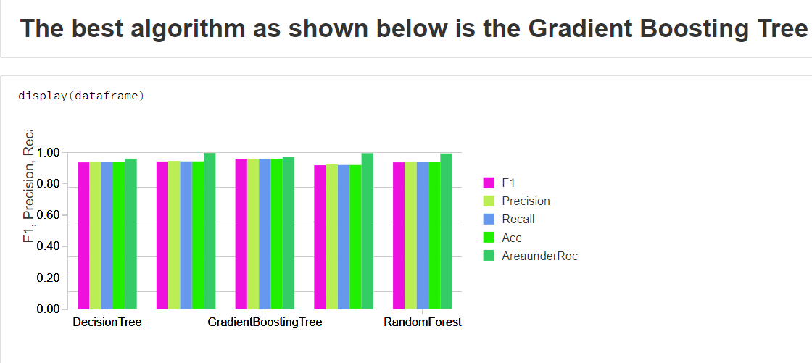

# Predictive-Analysis-of-BreastCancer
* Dataset: winconsin-dataset
* Language: Pyspark
* Environment: Databricks

## Objectives:
To analyse and model different machine learning algorithms Using PySpark
The various steps followed are
        1. Data Preparation
        2. Data Visualization
        3. Pipelining
        4. Applying Different Machie learning Algorithms 
        5. find best algorithm for Production environment

[click here for code](https://databricks-prod-cloudfront.cloud.databricks.com/public/4027ec902e239c93eaaa8714f173bcfc/6220173110189044/1607944556757705/2928770111703813/latest.html)

[click here for PPT presentaion](https://github.com/induraj2020/A6--Spark-Predictive-Analysis-of-BreastCancer-winconsin-dataset/blob/master/Predictive%20Analysis%20of%20Breast%20Cancer.pptx)

# Sample image of the ouput:

